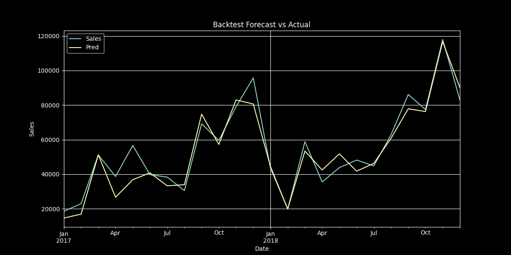

# Retail Analytics: Comprehensive Insights from the Superstore Dataset

## Introduction

This project analyzes the Superstore dataset, comprising over 9,800
transactions from 2015 to 2018, to derive actionable insights for retail
optimization. By leveraging advanced data science techniques, the
project examines sales trends, customer behavior, churn patterns, sales
forecasting, and market basket associations. Each analysis is paired
with visualizations to ensure transparency and facilitate understanding,
providing a robust foundation for strategic decision-making in inventory
management, customer retention, and marketing. The following sections
present key findings, supported by visual evidence stored in the
`visualizations/` folder.

## 1. Sales Analysis by Category and Sub-Category

To understand revenue distribution, sales were analyzed across product
categories (Technology, Furniture, Office Supplies) and their
sub-categories.

-   **Category Sales**: Office Supplies led in transaction volume,
    reflecting high demand for low-cost items, while Technology
    contributed the highest revenue due to premium pricing.
-   **Sub-Category Insights**:
    -   **Technology**: Phones drove significant revenue, while Copiers,
        despite high prices, underperformed due to low sales volume.
    -   **Furniture**: Chairs were the top revenue contributor,
        indicating strong demand.
    -   **Office Supplies**: Paper and Binders were the most sold items,
        underscoring their role as staple products.

These findings suggest prioritizing inventory for high-revenue
Technology products (e.g., Phones) and high-volume Office Supplies
(e.g., Paper, Binders), while reevaluating Copier strategies.

  
  
  
  

## 2. Sales Trends Over Time

Temporal analysis of sales revealed seasonal and long-term trends, using
daily sales, 30-day rolling averages, monthly rolling averages, and
aggregated monthly sales across years.

-   **Key Observations**: Sales exhibited a consistent upward trajectory
    from 2015 to 2018, with notable peaks in March, September, and
    November--December, driven by holiday and back-to-school seasons.
    The 30-day rolling average smoothed short-term fluctuations,
    confirming sustained growth.
-   **Monthly Patterns**: November and December consistently
    outperformed other months, while February showed the lowest sales.

These trends highlight opportunities for targeted promotions during peak
months and inventory planning to capitalize on seasonal demand.

  
  
  
  

## 3. Sales by Region and Segment

Sales were segmented by region (North, South, East, West) and customer
segment (Corporate, Consumer, Home Office), with a combined
region-segment analysis visualized using a bar graph.

-   **Insight**: Consumers in the East and West regions were the primary
    revenue contributors, accounting for the majority of sales. Other
    regions and segments, such as South-Home Office, showed lower
    contributions.

This suggests focusing marketing efforts on East and West Consumers to
maximize revenue, while exploring strategies to boost sales in
underperforming regions and segments.

  

## 4. Customer Lifecycle Segmentation

Customers were segmented into Active, At Risk, Churning, and Lost based
on their last purchase date, with recency thresholds defining each group
(e.g., Lost: no purchase in \>180 days). A bar graph visualized the
distribution.

-   **Insight**: Approximately 8% of customers were classified as Lost,
    indicating a moderate churn rate. Active customers dominated the
    distribution, reflecting a healthy customer base.

This finding underscores the need for retention strategies targeting the
8% Lost segment to recover potential revenue.

  

## 5. Customer Retention Analysis

Retention was analyzed using cohort analysis, tracking customers based
on their first purchase year and calculating retention rates over
subsequent years. A heatmap visualized retention by cohort.

-   **Insight**: Retention rates were strong, with 87% of customers from
    earlier years (e.g., 2015--2016) continuing to purchase in later
    years. Newer cohorts also showed promising retention.

High retention indicates effective customer engagement, but efforts
should continue to sustain loyalty among newer customers.

  

## 6. Churn by Customer Segment

The Lost customer segment was further analyzed by customer segment
(Corporate, Consumer, Home Office) using a normalized bar graph to
account for segment size.

-   **Insight**: Corporate and Home Office segments exhibited relatively
    higher churn rates compared to Consumers, suggesting
    segment-specific retention challenges.

Targeted retention campaigns for Corporate and Home Office customers
could reduce churn and stabilize revenue.

  

## 7. Purchase Patterns of Lost Customers

The purchase behavior of Lost customers was examined by analyzing the
number of purchases made before churning, visualized with a bar graph.

-   **Insight**: Customers with 5--20 purchases were the most likely to
    churn, indicating that mid-frequency buyers are at higher risk.

This suggests implementing loyalty programs or personalized offers for
customers with moderate purchase histories to prevent churn.

  

## 8. Churn Trend Over Time

The number of customers lost over time was tracked using a line plot to
identify churn patterns.

-   **Insight**: A recent increase in customer loss was observed, with a
    noticeable uptick in the number of customers stopping purchases in
    the last year of the dataset.

This trend highlights an urgent need for proactive retention strategies
to curb the growing churn rate.

  

## 9. Sales Forecasting

Sales were forecasted using a combination of ARIMA, seasonal
decomposition, and polynomial trend models. Two plots were generated:
one comparing forecast accuracy on test data and another projecting
sales for the next year.

-   **Insight**: The model accurately captured historical sales
    patterns, with seasonal decomposition contributing to high accuracy
    on test data. Future projections indicated continued sales growth,
    with expected seasonal peaks in Q4 2019.

These forecasts provide a reliable basis for inventory and marketing
planning, emphasizing preparation for holiday season demand.

***Metrics on Test data**
-   R2 Score: 0.9161
-   100 - MAPE: 89.04
-   RMSE: 7127.29

|  | |
|:--:|:--:|
| Sales Forecast Accuracy | Future Sales Forecast |

## 10. Basket Analysis and Optimization

Customer basket behavior was analyzed to understand purchasing patterns,
focusing on average basket size over time and basket size distribution.

-   **Average Basket Size**: A decline in average basket size was
    observed, indicating that customers are purchasing fewer items per
    transaction over time.
-   **Basket Size Distribution**: Most baskets contained 1--2 items,
    with larger baskets being rare.

These findings suggest opportunities to encourage larger purchases
through bundling or cross-selling strategies to reverse the declining
trend.

|  |  |
|:--:|:--:|
| Average Basket Size | Basket Size Distribution |

## 11. Market Basket Associations

Association rules were generated using the Apriori algorithm to identify
products frequently purchased together, visualized with a network graph.

-   **Insight**: Binders and Paper were central nodes, frequently paired
    with multiple other products (e.g., Accessories, Labels), indicating
    strong co-purchase patterns.

This insight supports targeted product placements and promotions to
leverage these associations, enhancing cross-selling opportunities.

  

## Conclusion

This retail analytics project delivers a comprehensive understanding of
the Superstore dataset, revealing critical insights for business
optimization. Key takeaways include: - **Revenue Optimization**:
Prioritize Technology products (e.g., Phones) and high-volume Office
Supplies (e.g., Paper, Binders) to maximize revenue, while addressing
underperforming sub-categories like Copiers. - **Customer Retention**:
Target Home Office and Corporate customers with retention campaigns,
focusing on mid-frequency buyers (5--20 purchases) to reduce the 8%
churn rate. - **Seasonal Strategies**: Capitalize on March, September,
and November--December sales peaks with targeted promotions and
inventory planning. - **Cross-Selling**: Leverage strong product
associations (e.g., Binders and Paper) to drive larger baskets through
bundling and recommendations. - **Forecasting**: Prepare for projected
2019 sales growth, particularly in Q4, based on accurate forecasts.

The project's rigorous analyses, supported by clear visualizations,
demonstrate proficiency in data science and business analytics. By
providing actionable recommendations, it serves as a valuable tool for
retail decision-making and a showcase of advanced analytical skills
suitable for professional portfolios.
